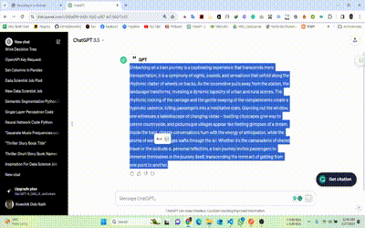
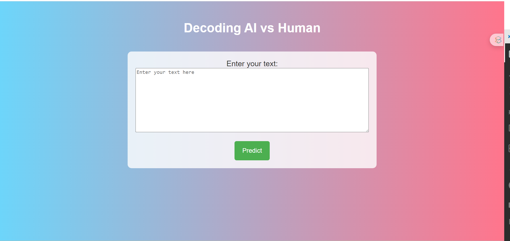
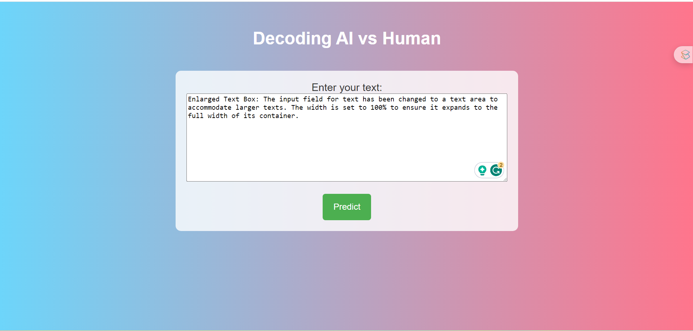
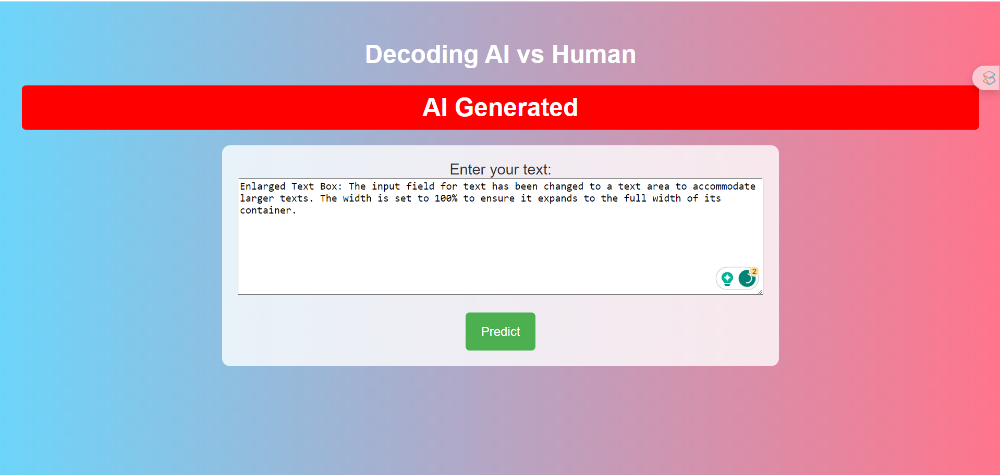
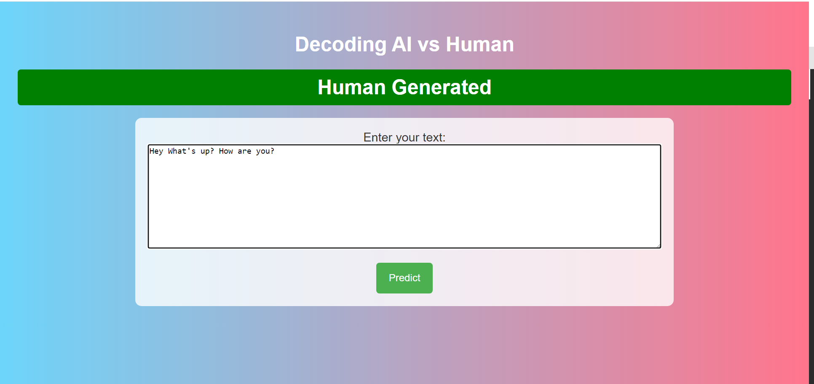

# Decoding AI 🤖 vs Human 🙎‍♂️
Decoding AI vs Human is an interactive web application that allows users to put any text and see if it was written by a human or an AI. This application is tranied on **Machine Hack** dataset. The dataset is available [here](https://machinehack.com/hackathons/llm_hackathon_decoding_discourse_ai_vs_human/overview).

## Features 📋
- **Text Classification** - The application classifies the text into two categories: AI or Human.

## AWS Deployment 🚀
The application is deployed on render. The application is available [here](https://decoding-ai-vs-human.onrender.com/).

📹 Demo video:
---


## Getting Started 🚀
To get a local copy up and running follow these simple steps.

1. Clone the repository:
    ```bash
    git clone https://github.com/kowshik24/Decoding-AI-vs-Human.git
    ```
2. Install the requirements:
    ```bash
    cd Decoding-AI-vs-Human
    pip install -r requirements.txt
    ```
3. Run the application:
    ```bash
    python app.py
    ```

🎥 Demo:
---
📸 Screenshots

|  |  |
|:--------------------------------:|:--------------------------------:|
|     **Sample Visualization 1**   |     **Sample Visualization 2**   |
|  |  |


---
📞 Contact Information
For support, feedback, or contributions, please reach out to:

- 📧 **Email**: [kowshikcseruet1998@gmail.com](mailto:kowshikcseruet1998@gmail.com)
- 📱 **Phone**: 01706 896161
- 🌐 **Website**: [https://kowshik24.github.io/kowshik.github.io/](https://kowshik24.github.io/kowshik.github.io/)
- 🚀 **GitHub**: [Kowshik Deb Nath](https://github.com/kowshik24)
- 🤝 **LinkedIn**: [Kowshik Deb Nath](https://www.linkedin.com/in/kowshik-deb-nath-7a0a3a1a0/)
---

